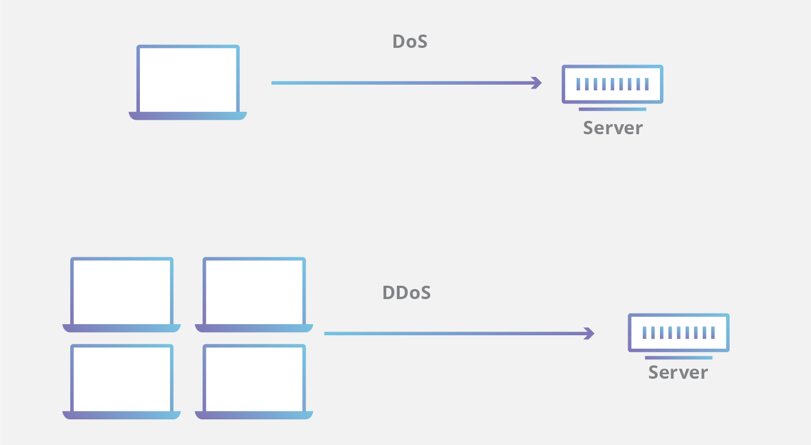

# **拒绝服务攻击**
## **什么是拒绝服务攻击？**
拒绝服务（DoS）攻击是一种网络攻击，恶意行为者**通过中断设备的正常功能**，使其目标用户无法使用计算机或其他设备。DoS 攻击通常**通过请求压垮或淹没目标计算机**，**直到其无法处理正常流量**，从而对其他用户造成拒绝服务。DoS 攻击的**特征是使用一台计算机来发起攻击**。

[分布式拒绝服务 (DDoS)攻击](https://www.cloudflare.com/zh-tw/learning/ddos/what-is-a-ddos-attack/) 是一种 DoS 攻击，它来自许多分布式来源，例如[僵尸网络 DDoS 攻击](https://www.cloudflare.com/zh-tw/learning/ddos/what-is-a-ddos-botnet/)
***
## **Dos攻击如何工作？**
DoS 攻击的主要重点是使目标计算机的容量过饱和，从而对其他请求造成拒绝服务。DoS 攻击具有多种攻击途径，可通过它们的相似性来分组。  
**通常分为如下两类：**
***
* **缓冲区溢出攻击** 在这一种攻击类型中，内存[缓冲区溢出](https://www.cloudflare.com/zh-tw/learning/security/threats/buffer-overflow/)可能导致计算机耗尽所有可用的硬盘空间、内存或 CPU 时间。这种利用形式通常会导致行为缓慢、系统崩溃或其他有害的服务器行为，从而造成拒绝服务。
***
* **洪水攻击** 通过使目标服务器充满大量数据包，恶意行为者便能够使服务器容量过饱和，从而导致拒绝服务。大多数 DoS 洪水攻击若要得逞，恶意行为者必须具有比目标更多的可用带宽。
***
## **历史上重大的Dos攻击**
从历史上看，DoS 攻击通常利用网络、软件和硬件设计中存在的安全漏洞。这种攻击已变得不那么普遍，因为 DDoS 攻击具有更强的破坏性，并且一旦有可用工具便相对容易实现。实际上，大多数 DoS 攻击也可以转变为 DDoS 攻击。

一些曾经常见的 DoS 攻击包括：
***
* **Smurf攻击** 一种曾被利用的 DoS 攻击。恶意行为者通过发送伪造的数据包来利用易受攻击的网络的广播地址，从而导致目标 IP 地址被淹没。
***
* **Ping洪水攻击** 这种简单的拒绝服务攻击基于用 ICMP (ping) 数据包使目标不堪重负。用数量超过其有效响应能力的 ping 来淹没目标，从而造成拒绝服务。此攻击也可以用作 DDoS 攻击。
***
* **死亡之Ping**  通常与 Ping 洪水攻击混为一谈，死亡之 Ping 攻击涉及将格式错误的数据包发送到目标计算机，从而导致系统崩溃等有害行为
***
## **如何判断计算机是否正在遭受Dos攻击？**
尽管很难将攻击与其他网络连接错误或高带宽消耗区分开来，但某些特征可能表明正在遭受攻击。
DoS 攻击的**迹象**包括：

* 网络性能通常会降低，例如文件或网站的加载时间比较长
* 无法加载特定网站，例如您的 Web 资产
* 同一网络中各设备之间的连接突然中断
***
## **DDoS 攻击和 DOS 攻击有什么区别？**
DDoS 和 DoS 之间的显著区别是攻击中使用的连接数。一些 DoS 攻击（如 Slowloris 等“慢速”攻击）的危害能力源自于实现它们的简单性和低要求性

DoS 攻击利用单个连接，而 DDoS 攻击则利用许多攻击流量来源，通常采用僵尸网络的形式。一般而言，许多攻击在本质上是相似的，可以使用更多恶意流量来源进行尝试。了解 Cloudflare 的 DDoS 防护如何阻止拒绝服务攻击